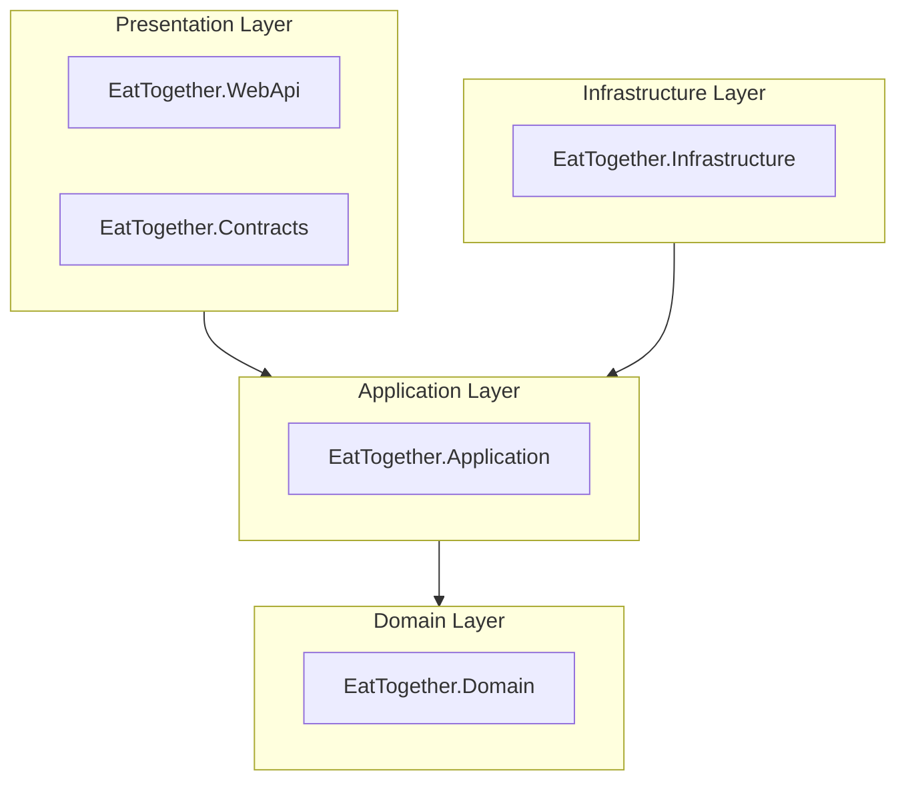

> **Warning**
> This repository includes a partially finished project that contains incomplete code. However, some sections of the project may be useful, such as the jwt auth implementation, solution structure or DDD seedwork. Please note that the repository is kept only for reference purposes, and there are no plans to update it. As a result, I cannot assure its relevace or security.

# Eat Together

RESTful web API following [clean architecture](https://jasontaylor.dev/clean-architecture-getting-started/), that allows users to share a meal with others.

*note: app is still WIP*

## How to run

### Prerequisites

- .NET 7 SDK
    - Windows: `winget install Microsoft.DotNet.SDK.7`
    - MacOS, Linux or other installation methods: [link](https://dotnet.microsoft.com/en-us/download/dotnet/7.0)

### Run via CLI

- `git clone github.com/kacperwyczawski/eattogether.git EatTogether`
- `cd EatTogether`
- `dotnet run`

## Architecture

Eat Together is following [Jason Taylor's clean architecture](https://jasontaylor.dev/clean-architecture-getting-started/) and Domain Driven Design (DDD) principles.
It's also based on [Amichai Mantinband's project](https://github.com/amantinband/buber-breakfast).

Dependencies between layers are as follows:

*note: EatTogether.WebApi depends on EatTogether.Infrastructure, but only for dependency injection in Program.cs*
