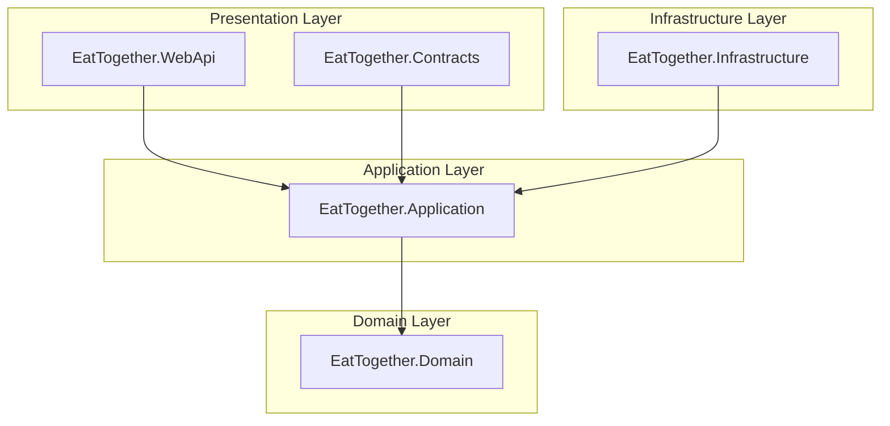

# Eat Together

RESTful web API following [clean architecture](https://jasontaylor.dev/clean-architecture-getting-started/), that allows users to share a meal with others.

*note: app is still WIP*

## How to run

### Prerequisites

- .NET 7 SDK
    - Windows: `winget install Microsoft.DotNet.SDK.7`
    - MacOS / Linux: [link](https://dotnet.microsoft.com/en-us/download/dotnet/7.0)

### Run via CLI

- `git clone github.com/kacperwyczawski/eattogether.git EatTogether`
- `cd EatTogether`
- `dotnet run`

## Architecture

Eat Together is following [Jason Taylor's clean architecture](https://jasontaylor.dev/clean-architecture-getting-started/) and Domain Driven Design (DDD) principles.
It's also based on [Amichai Mantinband's project](https://github.com/amantinband/buber-breakfast).

Dependencies between layers are as follows:

Temporary diagram below, since the one above is not working on github (despite working on mermaid.live)

*note: EatTogether.WebApi depends on EatTogether.Infrastructure, but only for dependency injection in Program.cs*
